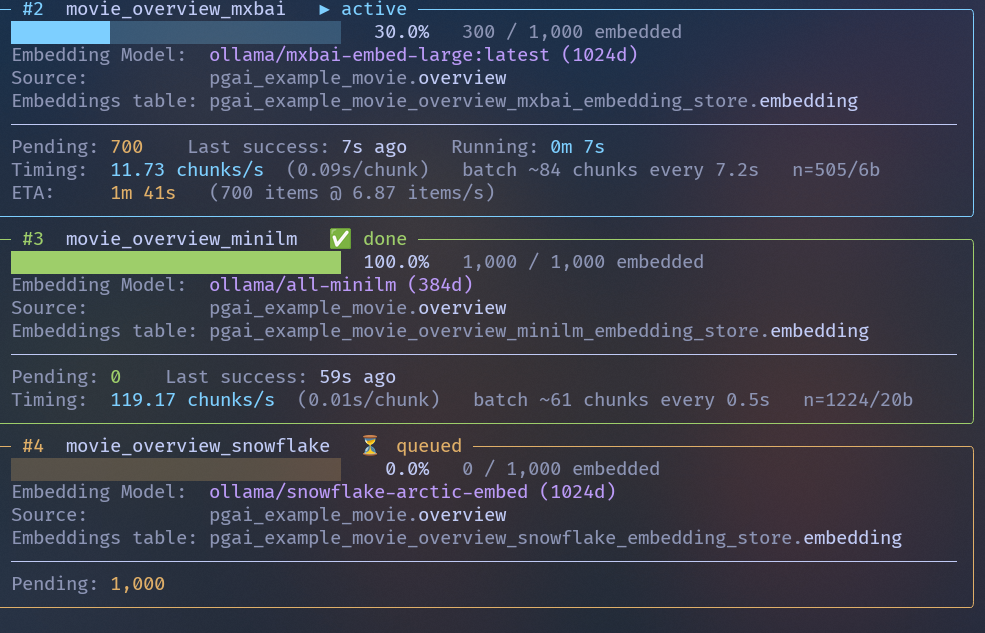
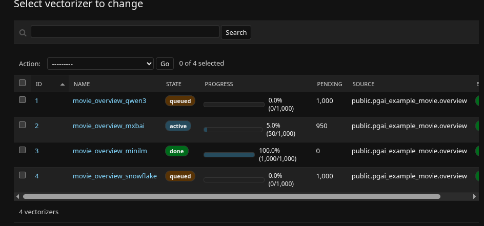

# django-pgai-example

A minimal Django project demonstrating the [`django-pgai`](https://github.com/omidev/django_pgai) plugin: vectorized text fields, automatic embedding generation via pgai + Ollama, and semantic search via Django ORM.

The example app (`pgai_example`) defines a `Movie` model with **four vectorizers over a single `overview` column** (qwen3, mxbai, all-minilm, snowflake-arctic), so you can compare embedding models on the same data.

---

## Clone & install

```bash
git clone https://github.com/omidev/django_pgai_example.git
cd django_pgai_example
cp .env.example .env   # then edit DJANGO_PGAI_PATH to point at your local django-pgai checkout
docker compose up -d
```

Requires Docker + Docker Compose and a local checkout of [`django-pgai`](https://github.com/omidev/django_pgai) — its path goes in `DJANGO_PGAI_PATH` in `.env`. Ollama runs inside the stack and pulls the embedding models on first use; nothing to download manually.

`./manage.sh foo` is shorthand for `docker compose exec django uv run python manage.py foo`. Use either.

---

## Setup

### 1. Install pgai

Start the stack and install the pgai PostgreSQL extension + plugin infrastructure:

```bash
docker compose up -d
./manage.sh pgai install
```

`pgai install` creates the pgai extension in Postgres and registers the supporting schema/tables the vectorizer worker relies on.

### 2. Make migrations & migrate

```bash
./manage.sh makemigrations pgai_example
./manage.sh migrate
```

The plugin auto-generates a follow-on migration (`0002_pgai_create_vectorizers`) that registers the four vectorizers declared on `Movie` with pgai.

### 3. Seed the Movies dataset

```bash
./manage.sh seed --variant mv-qwen
```

The data is pulled from the [`Cohere/movies`](https://huggingface.co/datasets/Cohere/movies) Hugging Face dataset (titles, overviews, genres, cast) and inserted into the `Movie` table. Variants: `mv-qwen`, `mv-mxbai`, `mv-minilm`, `mv-snowflake`. All four share the same `Movie` table, so seeding any of them populates the rows that every vectorizer then picks up.

Shortcut for the full path (makemigrations + migrate + seed):

```bash
./setup.sh build
```

### 4. Check vectorizer status

The `vectorizer-worker` service polls the queue and writes embeddings asynchronously. Inspect progress with the `pgai` management commands:

```bash
./manage.sh pgai list                          # all vectorizers + state
./manage.sh pgai vectorizer movie_overview_qwen3   # status panel for one
./manage.sh pgai activity                      # recent processing activity
./manage.sh pgai errors                        # recent worker errors
```



Tail the worker logs if something looks stuck:

```bash
docker compose logs -f vectorizer-worker
```

### 5. Create a superuser & browse Django admin

```bash
./manage.sh createsuperuser
```

Then open <http://localhost:8080/admin/> and log in. The `Movie` admin (registered via the plugin's `register_admin`) shows the source rows plus vectorization state for each vectorizer, so you can confirm that embeddings exist for every variant.



### 6. Try the usage commands

All demo commands live under `./manage.sh sample` and exercise different surface areas of the `django-pgai` API.

**Single API demos** (`sample usage api …`), one plugin entry point per command:

```bash
# similar_in.<field>.find()
./manage.sh sample usage api find "space heist" --variant mv-qwen

# .filter(genres__icontains=...) + semantic_score() annotation
./manage.sh sample usage api filter "lonely robot" --genre Sci-Fi

# semantic_score() expression on a plain queryset
./manage.sh sample usage api annotate "courtroom drama"

# Manager method objects.semantic_rank()
./manage.sh sample usage api rank "samurai revenge"
```

**Strategy comparisons** (`sample usage compare strategies …`), same query and variant, different knobs:

```bash
./manage.sh sample usage compare strategies rank-by   "machine learning"
./manage.sh sample usage compare strategies threshold "machine learning"
```

List the available model variants:

```bash
./manage.sh sample models --verbose
```

---

## Teardown / Rebuild

```bash
./setup.sh status      # row counts per pgai_example_* table
./setup.sh unbuild     # drop volume + delete migration files (destructive)
./setup.sh rebuild     # unbuild + build
```

---

## What you can do with it

```python
# Find rows most similar to a query string
Movie.similar_in.overview.find("space heist", limit=10)

# Combine an ORM filter with a similarity score
Movie.objects.filter(genres__icontains="Sci-Fi") \
    .annotate(score=semantic_score("overview", "lonely robot")) \
    .order_by("-score")[:10]

# Rank a queryset semantically
Movie.objects.semantic_rank("samurai revenge")[:10]
```

---

## Project layout

```
.
├── manage.py / manage.sh / setup.sh
├── docker-compose.yml
├── settings/                       # split settings (base, apps, i18n)
├── urls.py
└── pgai_example/
    ├── models.py                   # Movie + 4 VectorizedTextFields
    ├── admin.py                    # uses plugin's register_admin
    ├── migrations/
    └── management/
        ├── context.py              # ctx object (render/helpers/exceptions)
        ├── data_models.py
        ├── helpers/                # business logic helpers
        ├── renderers/              # CLI output components
        └── commands/
            ├── seed.py
            └── sample.py           # entry point for the `sample …` tree
```
