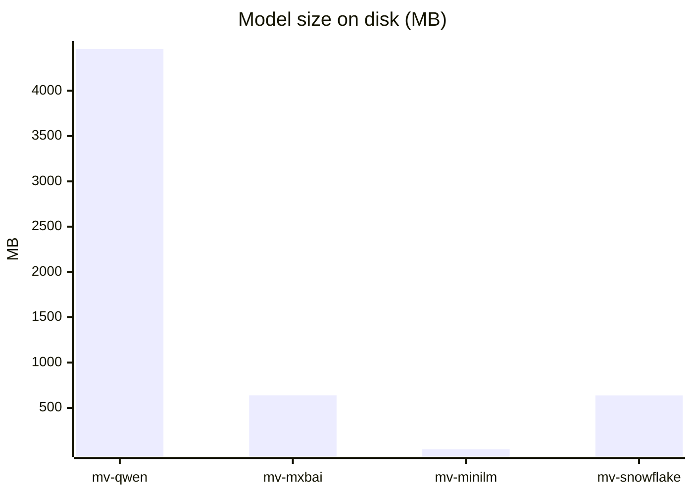
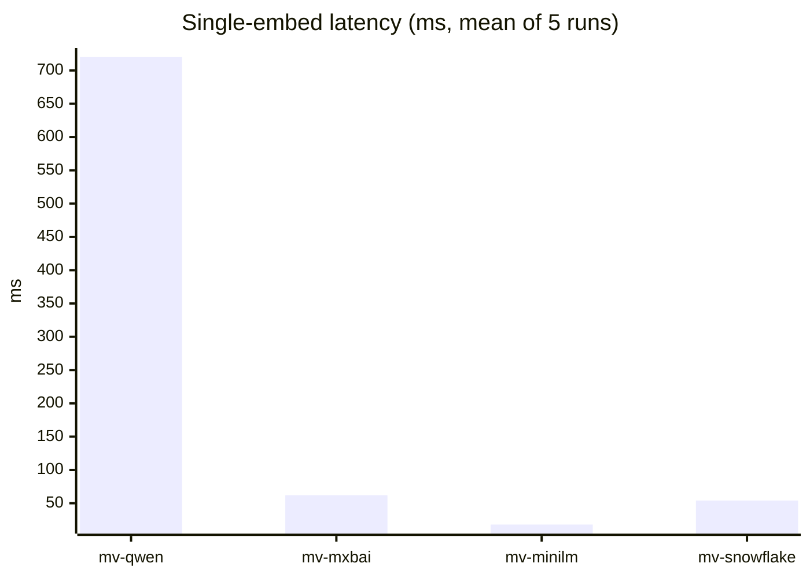
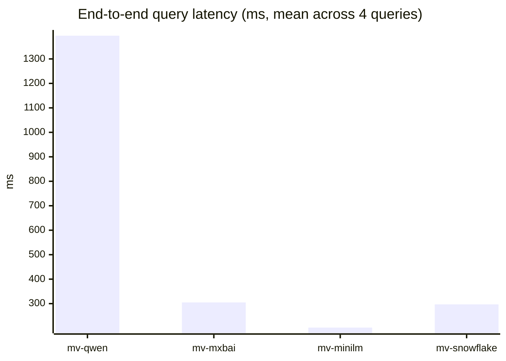
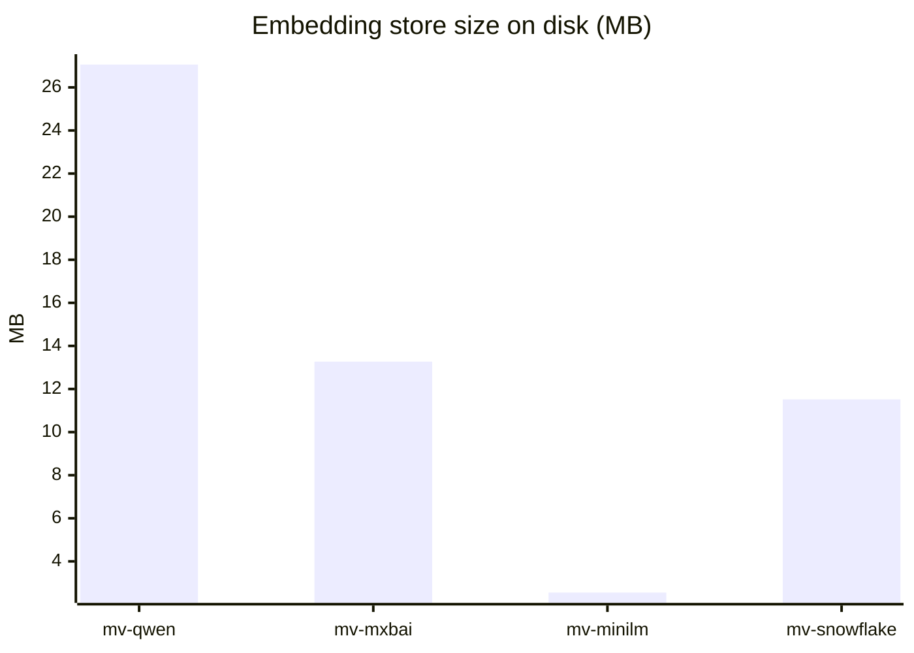
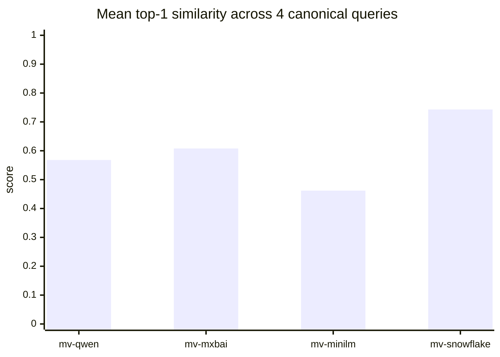

# Model Comparison: Embedding Variants on the `Movie` Dataset

A fair comparison of embedding models needs the same source text, the
same chunking, the same query API, and the same database. In
`django-pgai`, those are all properties of the model. Each embedding
candidate is one `VectorizedTextField`. Pointing several fields at the
same `source_field` lets the plugin manage parallel embedding spaces
over one column, and the query surface stays uniform across all of them.

What follows uses four embedding models, one corpus, and a fixed query
set. The tuning levers the plugin exposes for improving results without
leaving the ORM are covered alongside the results: chunk size, ranking
strategy, per model threshold calibration, and weighted multi model
blends.

## The experiment

The goal is to compare embedding models on equal footing. Same source
text, same query workload, same database, same plugin. The setup is
designed so the embedding model is the **only** variable that changes
between runs. Everything else (chunking layer, query API, similarity
metric, infrastructure) is held fixed by `django-pgai`.

**The sample dataset.** A 1,000 row sample from the
[`Cohere/movies`](https://huggingface.co/datasets/Cohere/movies) Hugging
Face dataset. Short English plot summaries, picked because they are a
representative short text workload that the four models under test are
all reasonably designed for. The same experiment mechanics apply
unchanged to any other corpus. Swap the dataset loader and re run the
benchmarks.

**What we vectorize.** The `Movie` model has one source text column,
`overview`, a 1 to 3 sentence English plot blurb (other columns like
`title`, `genres`, `producer`, `cast` are kept as ordinary structured
fields, not embedded). On top of `overview` we declare **four**
`VectorizedTextField`s. Three of them are *proxies* with
`source_field="overview"`. They don't add any text column, they just
ask `django-pgai` to produce a second, third, fourth embedding of the
same text using a different model. Same input, four parallel embedding
spaces.

**The four embedding models under test:**

- **`qwen3-embedding`** (Alibaba Qwen3 family). 4096 dim, **4.4 GB** on
  disk. Marketed for long form and multilingual retrieval. The largest
  model in the lineup.
- **`mxbai-embed-large`** (Mixedbread). 1024 dim, **0.64 GB**. A
  retrieval tuned default in many open weights stacks.
- **`all-MiniLM-L6-v2`** (Sentence Transformers). 384 dim, **0.04 GB**.
  The canonical small and fast embedding. Light enough to run anywhere.
- **`snowflake-arctic-embed`** (Snowflake). 1024 dim, **0.64 GB**.
  Distilled for retrieval, with multilingual emphasis.

All four are served by local Ollama instances (one per pgai role:
`ollama-worker` for background vectorization, `ollama-query` for query
time embeddings) sharing the same model cache on disk.

## What we measure

Two complementary sets of metrics, captured by two `django-pgai` based
benchmarks shipped with this repo.

**Static costs** (per embedding model and vectorizer):
- On disk model size, read from the Ollama HTTP API.
- Embedding store row count: how many chunks `django-pgai` produced
  from the same source text under that model's chunking parameters.
- Embedding store size on disk, via `pg_total_relation_size()`.
- Single embedding latency, measured by hitting Ollama's
  `/api/embeddings` directly with a fixed probe sentence. This isolates
  raw model cost from any database overhead.

**Query time performance** (per vectorizer, per query):
- Top N results returned by the plugin's
  `Model.similar_in.<field>.find(query)` API, the public entry point a
  user of `django-pgai` actually calls.
- Top 1 similarity score and the full result set, used as quality
  proxies and to spot qualitative agreement or disagreement between
  models on the same query.
- End to end latency for that same `find()` call, warm, across multiple
  runs (mean, p50, p95, min, max).

The query set is fixed: four canonical queries chosen to exercise
different semantic shapes. A literal or oddball phrase, a clear plot
and culture query, a concrete multi noun action query, and an abstract
mood query. Each variant runs each query the same number of times.

## How to reproduce

Two paths.

**Per query evaluation.** Run one query against all variants. Useful
for ad hoc spot checks of a query you care about, without writing the
canonical artifact:

```bash
./manage.sh sample usage compare models results "samurai revenge" -l 5
./manage.sh sample usage compare models time    "samurai revenge" -n 5
```

**Full canonical sweep.** Run the fixed query set and persist the
artifacts that back the tables and charts in this doc. Both commands
take `--output` as a required parameter:

```bash
./manage.sh sample usage compare cost --output <path/to/cost.json>
./manage.sh sample usage compare demo --output <path/to/usage.md>
```

`compare demo` writes a JSON sibling next to the markdown file (same
path with the `.json` extension).

---

## The four variants

| Key | Embedding model | Dim | Chunk size / overlap | Vectorizer name |
|---|---|---:|---:|---|
| `mv-qwen` | `qwen3-embedding` | 4096 | 300 / 30 | `movie_overview_qwen3` |
| `mv-mxbai` | `mxbai-embed-large:latest` | 1024 | 300 / 30 | `movie_overview_mxbai` |
| `mv-minilm` | `all-minilm` (MiniLM-L6-v2) | 384 | 400 / 30 | `movie_overview_minilm` |
| `mv-snowflake` | `snowflake-arctic-embed` | 1024 | 350 / 0 | `movie_overview_snowflake` |

The chunking parameters differ slightly between variants (mostly
`chunk_size`) because each model has a different recommended sequence
length. Those defaults are kept rather than forced into a single
artificial value.

---

## Cost table

Numbers from the `compare cost` JSON output (probe: a single short
overview style sentence, 5 runs, warm). `embed_ms` is the time for
Ollama to produce a single embedding via `/api/embeddings`. `query_ms`
is the mean end to end similarity search latency over the canonical
query set, from the `compare demo` JSON output.

| Variant | Dim | Model size | Embed `mean` | Embed `p95` | Query `mean` | Chunks | Index size |
|---|---:|---:|---:|---:|---:|---:|---:|
| `mv-qwen`      | 4096 | **4,461 MB** | **720 ms** | **771 ms** | **1,395 ms** | 1,612 | 27.06 MB |
| `mv-mxbai`     | 1024 |   639 MB |  62 ms |  67 ms |   305 ms | 1,612 | 13.27 MB |
| `mv-minilm`    |  384 |    44 MB |  **18 ms** |  19 ms |   **202 ms** | 1,224 |  **2.55 MB** |
| `mv-snowflake` | 1024 |   638 MB |  54 ms |  57 ms |   297 ms | 1,396 | 11.52 MB |

`mv-qwen` is the most expensive on every axis (model size, embed time,
query latency). `mv-minilm` is the cheapest on every axis. The
`qwen3-embedding` model alone is around 7× the size of every other
model combined:



`mv-mxbai` and `mv-snowflake` sit in the middle. Both are around 1024
dim with 640 MB models. `snowflake-arctic-embed` is consistently a hair
faster than `mxbai-embed-large` (54 vs 62 ms embed; 297 vs 305 ms query).

### Where the time goes

For non qwen variants, embed time is small relative to the full search:
around 20% on `mv-mxbai` (62/305), around 9% on `mv-minilm` (18/202),
and around 18% on `mv-snowflake` (54/297). The rest is the pgvector
similarity scan plus Django connection overhead. For `mv-qwen`, embed
time is around 52% (720/1395). The model itself becomes the bottleneck.



End to end query latency across the four canonical queries (mean of
5 warm runs each) tells the same story with a wider gap, because the
extra dimensionality of `qwen3-embedding` also slows the similarity
comparison itself:



### Storage scales linearly with dimension

The on disk size of each embedding store correlates almost exactly with
`dim × chunks × 4 bytes`:

| Variant | dim × chunks × 4 | actual index | ratio |
|---|---:|---:|---:|
| `mv-qwen` | 26.40 MB | 27.06 MB | 1.025 |
| `mv-mxbai` |  6.60 MB | 13.27 MB | 2.01  |
| `mv-minilm` |  1.88 MB |  2.55 MB | 1.36  |
| `mv-snowflake` |  5.72 MB | 11.52 MB | 2.01  |



The 2× overhead on the `mv-mxbai` and `mv-snowflake` stores is the
IVFFlat / HNSW index structure on top of the raw vectors. `mv-qwen`
stores vectors high enough in dim that the index overhead is amortized
into the row cost.

---

## Quality

The cheapest measurable proxy for "did the model understand the query"
is the top 1 similarity score and the gap between top 1 and the noise
floor. Higher top 1 *and* a wide gap means the result is confident and
the threshold is easy to set.

Top 1 scores across the four canonical queries (from the `compare demo` JSON output):

| Query | `mv-qwen` | `mv-mxbai` | `mv-minilm` | `mv-snowflake` |
|---|---:|---:|---:|---:|
| `cooking mice`                    | 0.560 | 0.568 | 0.453 | **0.690** |
| `samurai revenge`                 | 0.568 | 0.670 | 0.458 | **0.752** |
| `hacker breaks into the pentagon` | 0.572 | 0.598 | 0.476 | **0.760** |
| `existential dread`               | 0.570 | 0.596 | 0.459 | **0.768** |
| **Mean top 1** | 0.568 | 0.608 | 0.462 | **0.743** |



Top 1 alone is misleading. The `mv-qwen` vectorizer returned
**irrelevant** titles at the top on every canonical query (`Unforgiven`
for cooking mice, `Shrek Forever After` for samurai revenge, `Johnny
English Reborn` for the hacker query). Its high score on irrelevant
content reveals that, on this dataset and query length,
`qwen3-embedding`'s 4096 dim space is under discriminating in this
configuration. A lot of overviews score in a narrow band around 0.55.

The qualitative agreement picture across the same four queries:

| Query | Top 1 agreement |
|---|---|
| `cooking mice` | `mv-qwen` and `mv-minilm` agree on _Ratatouille_. `mv-mxbai` picks _Stuart Little 2_. `mv-snowflake` picks _Stuart Little_. |
| `samurai revenge` | All four disagree (semantic edge) |
| `hacker breaks into the pentagon` | All four disagree |
| `existential dread` | `mv-mxbai` and `mv-minilm` agree on _Final Destination 5_ |

The variant that most often returns hits a human would call relevant,
even when the top 1 differs across vectorizers, is `mv-snowflake` (using
`snowflake-arctic-embed`). For "samurai revenge" its top 5 is
_Hero / 47 Ronin / Furious 7 / The Last Samurai / The Wolverine_. Four
out of five clearly on topic.

---

## Cost vs benefit

The interesting derived metric is **score per millisecond**. Roughly,
"how much confidence am I buying per millisecond of latency":

| Model | Mean top 1 | Query mean (ms) | Score / ms |
|---|---:|---:|---:|
| `qwen3-embedding`        | 0.568 | 1395 | 0.0004 |
| `mxbai-embed-large`      | 0.608 |  305 | 0.0020 |
| `all-MiniLM-L6-v2`       | 0.462 |  202 | 0.0023 |
| `snowflake-arctic-embed` | 0.743 |  297 | **0.0025** |

`snowflake-arctic-embed` wins both halves: highest absolute quality and
the best quality per millisecond. `all-MiniLM-L6-v2` is competitive on
the rate purely because it is so fast. Its absolute scores are too
compressed to set useful thresholds against.

---

## When to pick which

| Use case | Pick | Why |
|---|---|---|
| **Default production search** | `snowflake-arctic-embed` | Highest absolute quality, widest score gap (best for thresholding), mid pack latency |
| **Latency critical (chat, autocomplete)** | `all-MiniLM-L6-v2` | 18 ms embed, 202 ms query, 44 MB model. Fits anywhere. Accept compressed scores. |
| **Balanced fallback** | `mxbai-embed-large` | Quality close to `snowflake-arctic-embed` on concrete queries. Small footprint. Well supported model. |
| **Avoid (for this dataset)** | `qwen3-embedding` | 5 to 7× slower than the others with worse top 1 relevance. Bigger isn't better on short corpora. |
| **Belt and suspenders robustness** | `snowflake-arctic-embed` + `mxbai-embed-large` blended | Re rank disagreements (see [USAGE.md §Combining multiple models](USAGE.md#combining-multiple-models)) |

### A note on `mv-qwen`

The poor showing of the `mv-qwen` vectorizer on this benchmark is
dataset shaped, not a verdict on `qwen3-embedding` itself. Qwen3's
design points are long documents and multilingual queries. Movie
overviews are 1 to 3 sentence English blobs. Exactly the kind of input
where a smaller, retrieval tuned model (`snowflake-arctic-embed`,
`mxbai-embed-large`) outperforms a general purpose large embedder.
Re run this benchmark on a multilingual corpus, or on documents 10×
longer, and the ranking may invert.

---

## Using `django-pgai` on your own data

This comparison is a demonstration. The actual invitation is to add the
plugin to your own Django application and use it the way this example
does: declare one or more `VectorizedTextField`s on a model, let the
worker handle embedding writes, and query through the normal ORM.
Particularly useful for models that carry large free text fields where
exact match or `ILIKE` stop being enough.

You don't need this repo's dataset or seed step to do that. Pick the
embedding model that fits your text shape (the table above is one
reference point), declare the field, run `makemigrations` and
`migrate`, and the query mechanisms in [`USAGE.md`](USAGE.md) become
available against your own rows.
